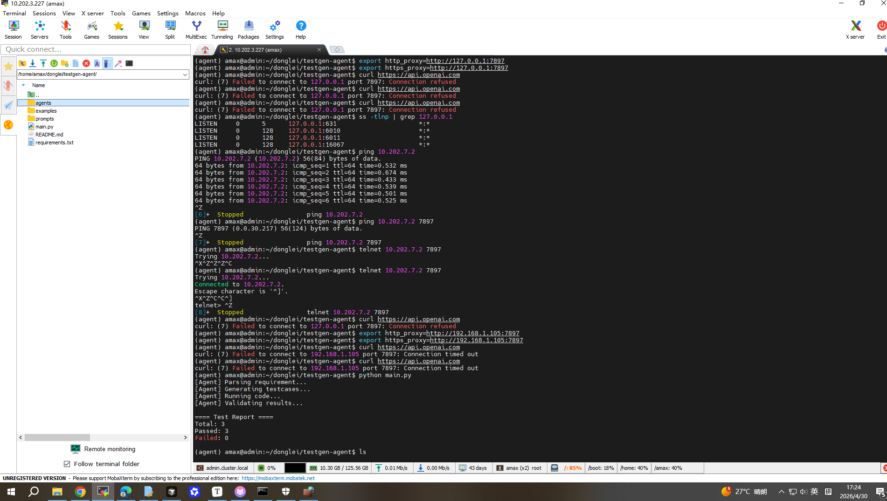
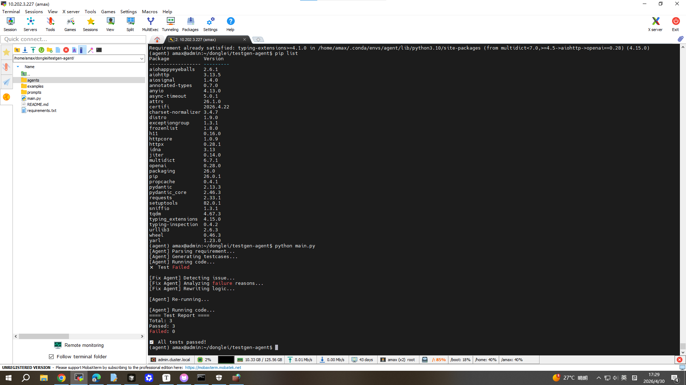

```
# TestGen Agent 🚀

A multi-agent system for automated testcase generation, execution, validation, and self-healing using LLMs.

---

## ✨ Features
- Requirement parsing agent
- Testcase generation agent
- Code execution agent
- Validation agent
- 🔥 Auto Fix Agent (self-healing loop)

---

## 🧠 Architecture

Multi-Agent Workflow:

Requirement → Testcase → Execution → Validation → Fix → Re-run

---

## ▶️ Example Output

```bash
[Agent] Parsing requirement...
[Agent] Generating testcases...
[Agent] Running code...
[Agent] Validating results...

==== Test Report ====
Total: 5
Passed: 5
Failed: 0
```

------

## 📌 Use Cases

- Algorithm testing
- Automated QA
- Code evaluation

------

## 🚧 Future Work

- UI interface
- Coverage analysis
- Multi-language support

------

## 🔥 Advanced Feature: Auto Fix Agent

This system supports automatic code repair.

When test cases fail:

1. Analyze execution results
2. Identify logical errors
3. Generate corrected code
4. Re-run tests

👉 This creates a **self-healing system**

------

## ⚙️ How to Run

```
pip install -r requirements.txt
python main.py
```

------

## 📷 Demo

### 🟢 1. Normal Execution (Baseline)

This shows the standard multi-agent pipeline execution.



---

### 🔴 2. Auto-Fix Self-Healing Execution

This demonstrates the system's **self-healing capability**, where the Auto-Fix Agent detects execution failure and automatically repairs the logic until the test passes.



------

## 📖 Description

This project demonstrates:

- Multi-agent collaboration
- Long-chain reasoning
- Automated testing and fixing loop using LLMs

